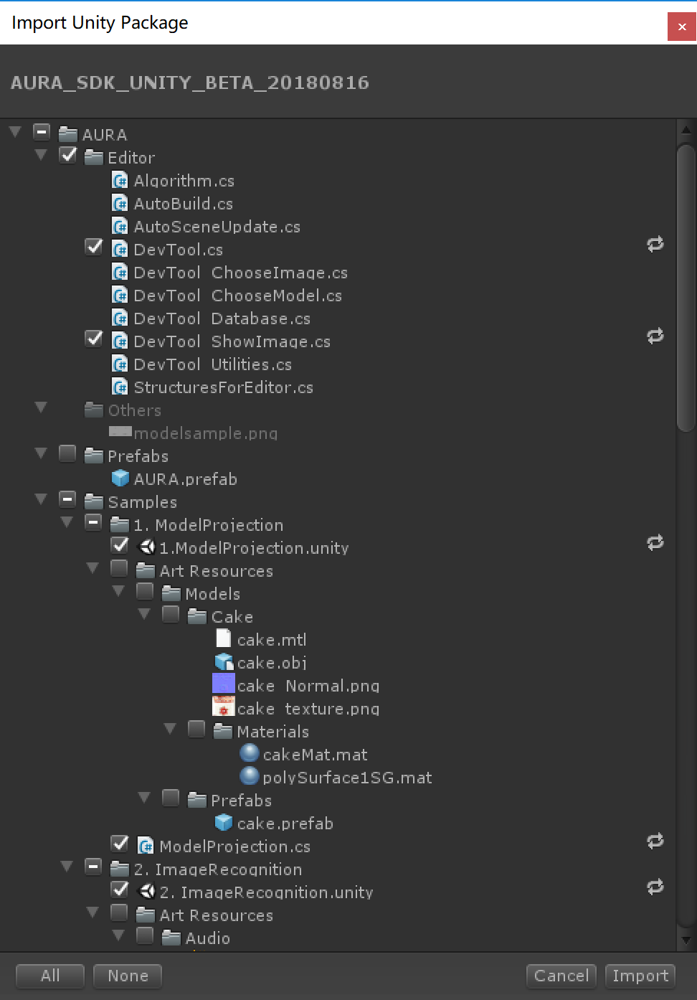
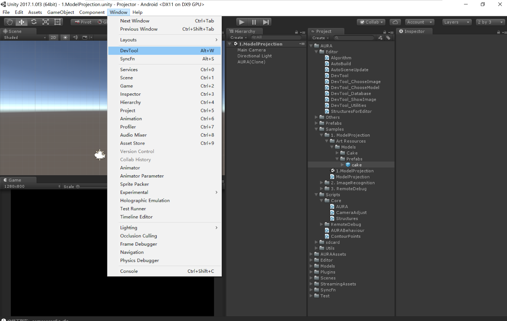
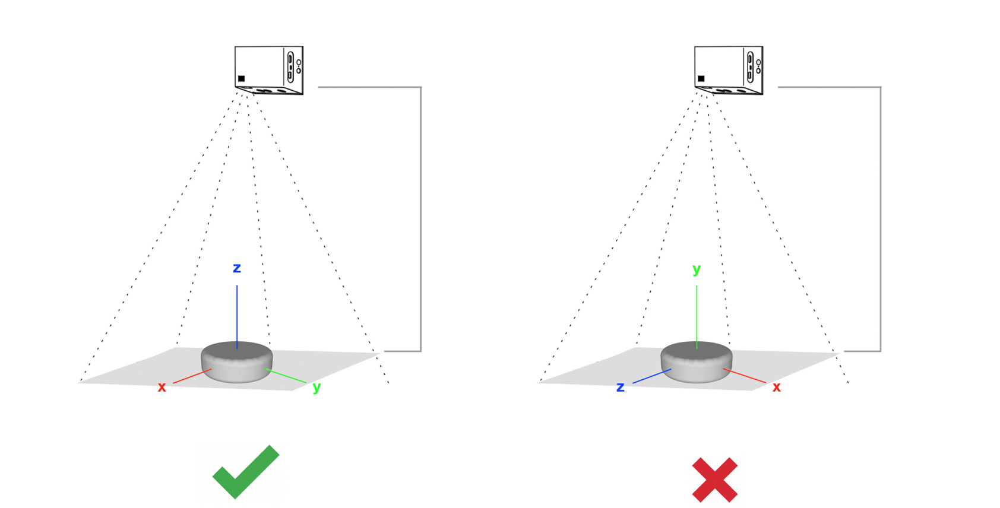
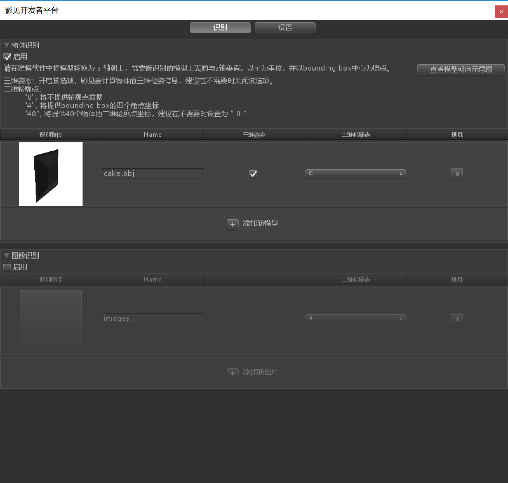
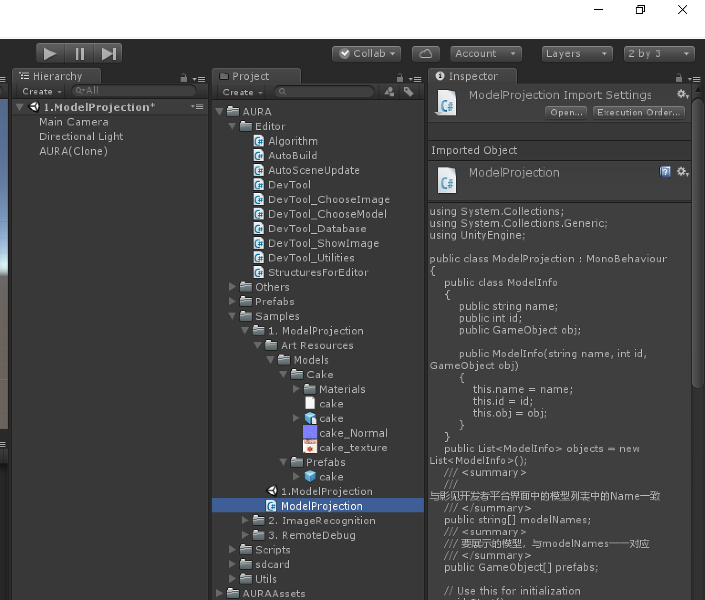
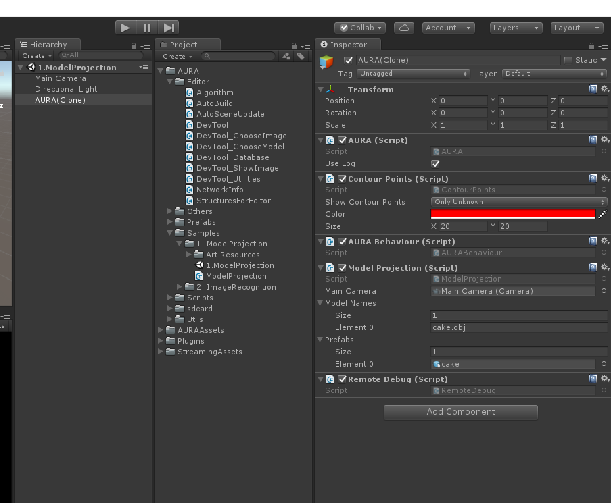
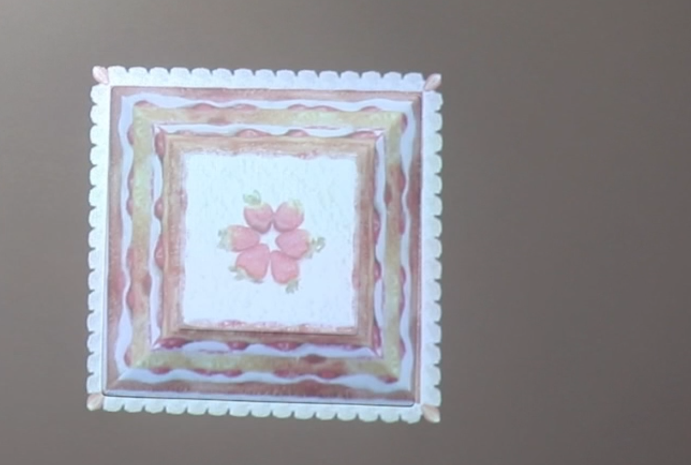

# 快速入门：创建你的第一个Aura应用

### **Step 1: 上传待识别的物体模型并生成算法数据**

1. 导入AURA\_SDK\_UNITY.unitypackage，如下图所示。

2. 导入插件后，打开Windows -&gt; DevTool,  选择需要的识别功能，并上传相应的3D模型或图像，插件将会自动生成识别所需要的算法训练数据。

3. 在开发者工具界面中，默认物体识别是启用状态 （当前物体识别和图像识别不能同时开启），点击“添加新模型”，从本地上传待识别物体的3D模型，点击确定，插件会自动生成算法训练数据并导入模型于工程中。

_**注意：当前支持\*.obj、\*.fbx格式的模型文件，创建模型时请以米 \(m\) 为单位，并确保模型的上表面与z轴垂直，并以模型的bounding box中心为原点。**_

4. 完成添加模型之后，返回开发者工具主界面，如下图，蛋糕模型已经被添加在识别物体的列表中。如有需要，可修改物体的名称，勾选是否需要三维位姿、二维轮廓点数据。

当前应用需要立体投影，因此勾选三维位姿，二维轮廓点设置为 ”0”。

5. 关闭开发者工具。

### **Step 2: 针对目标物体进行1:1 立体模型投影**

模型上传成功后，返回Unity界面，从工程资源列表中，找到ModelProjection脚本（路径：AURA - Samples - 1. ModelProjection），并将其拖拽到 AURA\(Clone\) 上。

此时，可以在AURA -&gt;ModelProjection 看到modelNames和prefabs两个数组，modelNames对应开发者工具窗口中的模具的Name，prefabs则是要投影到模具上的三维模型，这两个数组是一一对应的关系。并且，将场景主相机拖到MainCamera槽中。如下图所示：

### **Step 3: 发布APK到影见设备**

1. 依次打开 File &gt; Build Settings , 确认Platform中选择了Android, 否则需要选择Android &gt; Switch Platform

2. 在Buid Settings对话框中，点击Player Settings， 选择Other Settings, 编辑以下内容后，点击Build

* Company Name： 公司名称或自定义名称（英文）
* Product Name： 产品名称（英文）
* Package Name：文件包名称，注意请不要使用 com.AI.AURA\_SDK\_UNITY作为文件包名称
* Minimum API Level：最小支持的安卓版本号，请选择 Android 4.4

3. 将影见设备通过usb连接电脑后，通过adb命令行将生成的apk安装到影见设备中运行，命令行格式如下：

$ adb install /path/xxx.apk

4. 发布应用成功后，在影见端打开该应用，放入目标物体，当影见每次识别到该物体及其位姿后，将会对其投影对应的3D模型，如下图。通过插件发布的应用，初次在影见设备上打开时，会自动拷贝相应的算法文件（与该应用中需识别的模型或图像相对应）到SD卡中，待拷贝完成后，即可开始应用体验。

  

